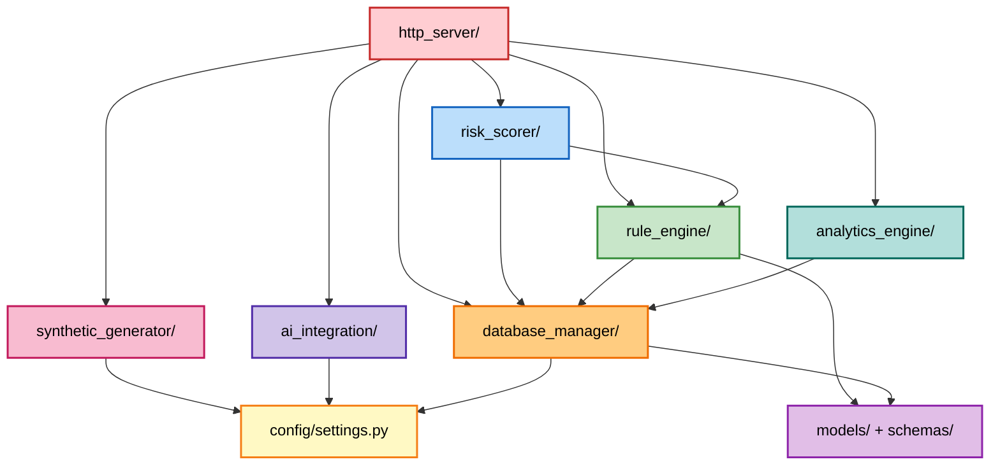

# Code Summary — Unit 1: Core Engine

## Module Overview

| # | Module | Purpose | Files | Stories |
|---|--------|---------|-------|---------|
| 1 | Database Manager | SQLite3 engine, WAL mode, sessions, schema, seeding | 4 | US 2.1 |
| 2 | Rule Engine | 5 fraud rules + abstract base + registry loader | 7 | US 2.1, US 2.2 |
| 3 | Risk Scorer | Weighted average, classification, tie-breaking, batching | 4 | US 2.1 |
| 4 | Analytics Engine | Fraud trends, category breakdown, risk distribution, top flagged | 4 | US 4.2 |
| 5 | AI Integration | Gemini HTTPS client, prompt builder, response parser | 3 | US 3.1 |
| 6 | Internal HTTP Server | FastAPI server + route definitions | 2 | All |
| 7 | Synthetic Generator | 1,000 INR transaction generator + anomaly injector | 3 | US 1.1 |

---

## File Inventory

### `core_engine/config/`
| File | Description |
|------|-------------|
| `settings.py` | Environment variable loading, default thresholds, rule weights, API key config |

### `core_engine/database_manager/`
| File | Description |
|------|-------------|
| `engine.py` | SQLite3 engine creation with WAL mode and foreign keys |
| `session.py` | Scoped session factory with context manager |
| `migrations.py` | ORM model definitions + CREATE TABLE for all 5 entities |
| `seed.py` | Default rule_config seeding (5 rules with weights/thresholds) |

### `core_engine/schemas/`
| File | Description |
|------|-------------|
| `pydantic_schemas.py` | All Pydantic request/response models for API serialization |

### `core_engine/rule_engine/`
| File | Description |
|------|-------------|
| `base_rule.py` | Abstract base class with `evaluate()` and `RuleEvaluation` dataclass |
| `high_value.py` | Amount threshold rule — `min(100, (amount/threshold) * 50)` |
| `odd_hours.py` | IST midnight-5AM rule — fixed score 80 |
| `velocity.py` | Rolling 10-min window rule — `min(100, (count/threshold) * 60)` |
| `geo_anomaly.py` | Last 3 cities comparison — fixed score 90 |
| `merchant_mismatch.py` | Top 5 historical categories — fixed score 70 |
| `rule_registry.py` | Load active rules from SQLite3, execute all against a transaction |

### `core_engine/risk_scorer/`
| File | Description |
|------|-------------|
| `weighted_scorer.py` | `SUM(raw * weight) / SUM(weight)` algorithm |
| `risk_classifier.py` | LOW (0-30), MEDIUM (31-69), HIGH (70-100) classification |
| `tie_breaker.py` | Severity-based ranking: velocity > geo > high_value > mismatch > odd_hours |
| `batch_processor.py` | 100-record batch processing for 4GB RAM constraint |

### `core_engine/analytics_engine/`
| File | Description |
|------|-------------|
| `fraud_trends.py` | Daily fraud rate aggregation over configurable time windows |
| `category_breakdown.py` | Merchant category distribution with average risk scores |
| `risk_distribution.py` | Score histogram across LOW/MEDIUM/HIGH levels |
| `top_flagged.py` | Top N flagged merchants ranking by frequency |

### `core_engine/ai_integration/`
| File | Description |
|------|-------------|
| `prompt_builder.py` | Indian banking context prompt with transaction data + top 3 rule reasons |
| `gemini_client.py` | Async HTTPS client via httpx, 5s timeout, structured error fallback |
| `response_parser.py` | JSON extraction from Gemini response with markdown code block cleaning |

### `core_engine/http_server/`
| File | Description |
|------|-------------|
| `server.py` | FastAPI app entry point with startup DB initialization |
| `routes.py` | All API route handlers (8 endpoints) |

### `core_engine/synthetic_generator/`
| File | Description |
|------|-------------|
| `indian_context.py` | Indian bank names, merchant names, city pools, IST timestamps |
| `anomaly_injector.py` | Weighted anomaly injection (velocity 30%, high_value 25%, geo 20%, mismatch 15%, odd_hours 10%) |
| `generator.py` | Orchestrates 1,000 transaction creation with account pooling |

### `core_engine/tests/`
| File | Description |
|------|-------------|
| `test_database_manager.py` | Engine creation, table creation, seeding, session lifecycle |
| `test_rule_engine.py` | Each rule individually with edge cases and boundary conditions |
| `test_risk_scorer.py` | Weighted math, boundary scores, tie-breaking, classification |
| `test_synthetic_generator.py` | Record count, INR currency, anomaly ratios, Indian context |
| `test_analytics_engine.py` | Aggregation accuracy, empty dataset handling |
| `test_ai_integration.py` | Prompt structure, JSON parsing, timeout fallback |
| `test_http_server.py` | FastAPI TestClient endpoint integration tests |

---

## API Reference (Internal HTTP Server)

| Method | Path | Purpose | Module | Story |
|--------|------|---------|--------|-------|
| GET | `/health` | Health check | Server | Infra |
| GET | `/api/v1/transactions` | List transactions (paginated, filterable) | HTTP Server | US 4.1 |
| GET | `/api/v1/transactions/{id}` | Get single transaction with risk score + rule results | HTTP Server | US 4.1 |
| POST | `/api/v1/transactions/generate` | Generate synthetic data, score, persist | Synthetic Generator | US 1.1 |
| GET | `/api/v1/rules` | List all rule configurations | Rule Engine | US 2.1 |
| PUT | `/api/v1/rules/{rule_name}` | Update rule weight/threshold/active status | Rule Engine | US 2.1 |
| GET | `/api/v1/analytics` | Get complete analytics summary | Analytics Engine | US 4.2 |
| POST | `/api/v1/analyze` | Trigger AI analysis for a transaction | AI Integration | US 3.1 |

---

## Database Schema Reference

```sql
CREATE TABLE transactions (
    id TEXT PRIMARY KEY,
    account_number VARCHAR(16) NOT NULL,
    account_holder VARCHAR(100) NOT NULL,
    amount FLOAT NOT NULL,
    timestamp DATETIME NOT NULL,
    city VARCHAR(50) NOT NULL,
    merchant_name VARCHAR(100) NOT NULL,
    merchant_category VARCHAR(50) NOT NULL,
    bank_name VARCHAR(100) NOT NULL,
    transaction_type VARCHAR(10) NOT NULL,
    is_flagged BOOLEAN DEFAULT FALSE,
    created_at DATETIME
);

CREATE TABLE risk_scores (
    id TEXT PRIMARY KEY,
    transaction_id TEXT NOT NULL UNIQUE REFERENCES transactions(id),
    final_score FLOAT NOT NULL,
    risk_level VARCHAR(10) NOT NULL,
    rules_triggered INTEGER DEFAULT 0,
    calculated_at DATETIME
);

CREATE TABLE rule_config (
    id TEXT PRIMARY KEY,
    rule_name VARCHAR(50) UNIQUE NOT NULL,
    weight FLOAT NOT NULL DEFAULT 0.20,
    threshold FLOAT NOT NULL,
    is_active BOOLEAN DEFAULT TRUE,
    updated_at DATETIME
);

CREATE TABLE rule_results (
    id TEXT PRIMARY KEY,
    transaction_id TEXT NOT NULL REFERENCES transactions(id),
    rule_name VARCHAR(50) NOT NULL,
    triggered BOOLEAN DEFAULT FALSE,
    raw_score FLOAT DEFAULT 0.0,
    weighted_score FLOAT DEFAULT 0.0,
    details TEXT DEFAULT ''
);

CREATE TABLE ai_analyses (
    id TEXT PRIMARY KEY,
    transaction_id TEXT NOT NULL UNIQUE REFERENCES transactions(id),
    prompt_sent TEXT NOT NULL,
    response_raw TEXT DEFAULT '',
    pattern_explanation TEXT DEFAULT '',
    top_risk_factors TEXT DEFAULT '',
    recommendation TEXT DEFAULT '',
    response_time_ms FLOAT DEFAULT 0.0,
    analyzed_at DATETIME
);
```

### Default Seed Data (rule_config)

| rule_name | weight | threshold | is_active |
|-----------|--------|-----------|-----------|
| high_value | 0.20 | 50000.0 | 1 |
| odd_hours | 0.10 | 5.0 | 1 |
| velocity | 0.30 | 3.0 | 1 |
| geo_anomaly | 0.25 | 3.0 | 1 |
| merchant_mismatch | 0.15 | 5.0 | 1 |

---

## Module Dependency Map



---

## Configuration Reference

| Environment Variable | Default | Description |
|---------------------|---------|-------------|
| `GEMINI_API_KEY` | (empty) | Gemini API key for AI analysis |
| `GEMINI_TIMEOUT_SECONDS` | 5 | HTTPS timeout for Gemini calls |
| `GEMINI_MODEL` | gemini-2.0-flash | Gemini model identifier |
| `DATABASE_URL` | sqlite:///fraudshield.db | SQLite3 database path |
| `HOST` | 127.0.0.1 | Server bind host |
| `PORT` | 8000 | Server bind port |
| `DEBUG` | false | Enable debug logging and auto-reload |
| `BATCH_SIZE` | 100 | Transactions per scoring batch (RAM control) |

---

## Test Coverage Summary

| Test File | Target Module | Key Test Cases | Story |
|-----------|--------------|----------------|-------|
| `test_database_manager.py` | Database Manager | Engine creation, table verification, seed idempotency | US 2.1 |
| `test_rule_engine.py` | Rule Engine | Each rule boundary conditions, trigger/no-trigger | US 2.1, US 2.2 |
| `test_risk_scorer.py` | Risk Scorer | Weighted math, classification boundaries, tie-breaking order | US 2.1 |
| `test_synthetic_generator.py` | Synthetic Generator | Count correctness, INR currency, anomaly ratios | US 1.1 |
| `test_analytics_engine.py` | Analytics Engine | Empty DB handling, aggregation queries | US 4.2 |
| `test_ai_integration.py` | AI Integration | Prompt structure, JSON parsing, fallback on invalid input | US 3.1 |
| `test_http_server.py` | HTTP Server | Endpoint status codes, CRUD validation, generation flow | All |
