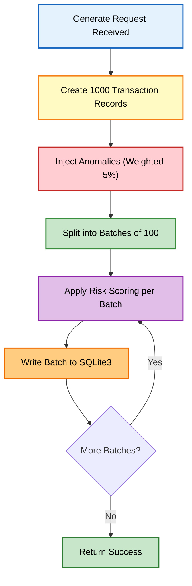

# Business Logic Model — Unit 1: Core Engine

## 1. Weighted Average Risk Scoring Algorithm

### Algorithm Definition
The risk score is calculated as a **weighted average** of all active rule evaluations for a given transaction.

```
Final Score = SUM(rule_raw_score × rule_weight) / SUM(rule_weight)
```

Where:
- `rule_raw_score` = Individual rule score (0–100) based on how severely the rule was violated
- `rule_weight` = Configurable numeric weight from the RULE_CONFIG table in SQLite3

### Score Boundaries
- **Minimum**: 0 (no rules triggered)
- **Maximum**: 100 (all rules triggered at maximum severity)
- **Precision**: Rounded to 2 decimal places

### Risk Level Classification
| Range | Level | Color Code |
|-------|-------|------------|
| 0–30 | LOW | 🟢 Green |
| 31–69 | MEDIUM | 🟡 Yellow |
| 70–100 | HIGH | 🔴 Red |

### Tie-Breaking Rule (Answer: B)
When multiple transactions produce identical final scores, ranking is determined by **rule severity order**:
1. Velocity check (highest priority)
2. Geographic anomaly
3. High value transaction
4. Merchant category mismatch
5. Odd-hours transaction (lowest priority)

---

## 2. Synthetic Data Generation Logic

### Generation Parameters
- **Volume**: Exactly 1,000 transactions per generation cycle
- **Currency**: Strictly INR (₹)
- **Context**: Indian bank names, Indian merchant names, Indian city names
- **Timestamps**: IST timezone only

### Anomaly Injection (Answer: B — Weighted Distribution)
Approximately 5% of records (50 transactions) are injected with anomalies using weighted distribution:

| Rule Type | Injection Weight | Approximate Count |
|-----------|-----------------|-------------------|
| Velocity Check | 30% | ~15 transactions |
| High Value | 25% | ~12 transactions |
| Geographic Anomaly | 20% | ~10 transactions |
| Merchant Mismatch | 15% | ~8 transactions |
| Odd-Hours | 10% | ~5 transactions |

### Processing Flow


---

## 3. AI Prompt Compilation and Processing

### Prompt Structure
The prompt sent to Gemini API includes:
1. System context: Indian banking fraud detection role
2. Transaction data: All fields from the Transaction entity
3. Rule results: Which rules fired, individual scores, weighted contributions
4. Top 3 weighted reasons extracted from Rule Results
5. Request for: Pattern explanation and actionable recommendation

### Response Parsing
The raw Gemini response is parsed into structured fields:
- `pattern_explanation`: Natural language explanation of detected pattern
- `top_risk_factors`: Top 3 weighted contributing factors
- `recommendation`: Actionable suggestion (block/monitor/allow with reasoning)

### Failure Fallback (Answer: A)
When the Gemini API call fails (timeout at 5s, rate limit, network error):
- Return a structured error response containing only the rule-based analysis
- Include all Rule Result data and the weighted Risk Score
- Set `ai_status: "unavailable"` in the response payload
- Do NOT retry automatically — the dashboard can offer a manual retry button
