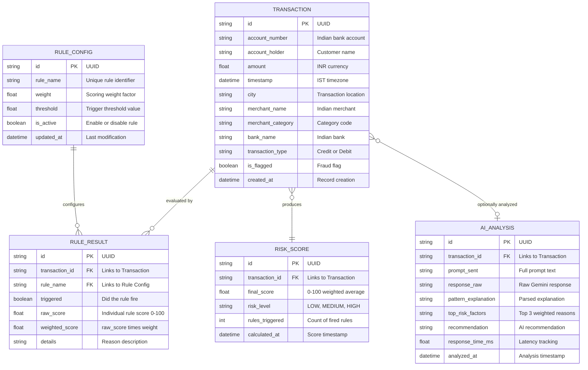

# Domain Entities — Unit 1: Core Engine

## Entity Relationship Diagram

## Entity Descriptions

### Transaction
The central entity representing a single banking transaction. All fields are strictly localized to the Indian BFSI context (INR amounts, Indian bank names, Indian cities, IST timestamps).

### Risk Score
A computed aggregate result linked 1:1 to a Transaction. Contains the final weighted average score (0-100) and the derived risk level classification (LOW: 0-30, MEDIUM: 31-69, HIGH: 70-100).

### Rule Config
Runtime-configurable rule definitions stored in SQLite3. Each rule has a unique name, a numeric weight for the scoring algorithm, a threshold value for triggering, and an active/inactive toggle. Modifiable at runtime via API Gateway endpoints.

### Rule Result
A per-rule evaluation record linked to both a Transaction and a Rule Config. Captures whether the rule triggered, the individual raw score, the weighted contribution, and a human-readable reason string.

### AI Analysis
An optional enrichment entity created only when a Fraud Analyst clicks "Analyze with AI." Stores the full prompt, raw Gemini response, parsed pattern explanation, top 3 risk factors, and the AI recommendation.
