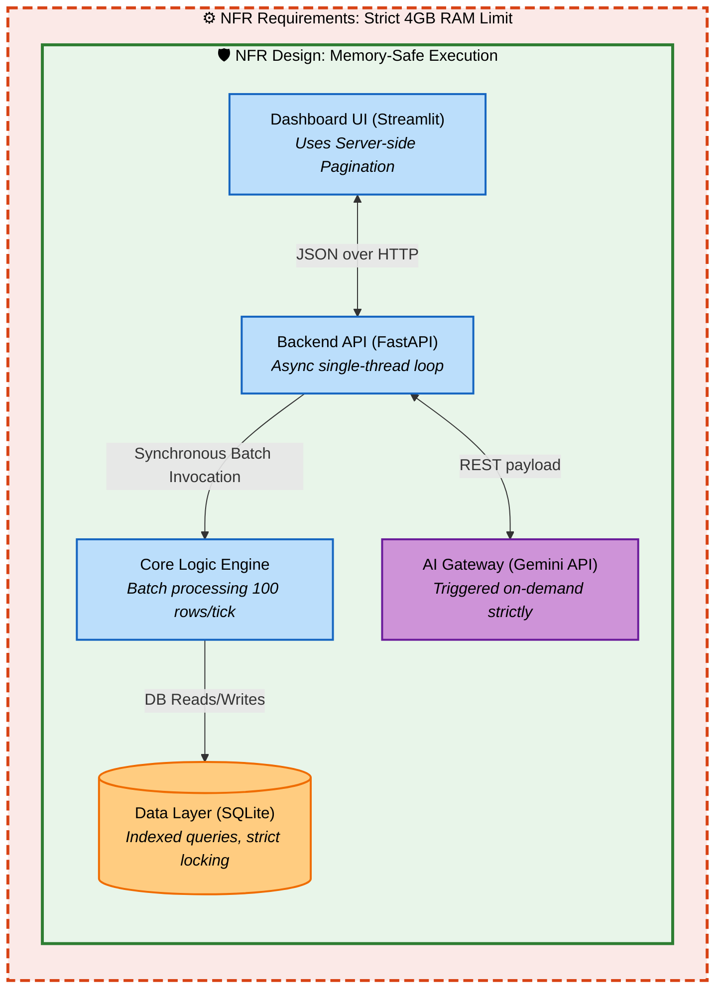

# Component Dependency & NFR Architecture

This diagram visualizes how the components interact, explicitly charting the NFR Requirements (4GB RAM bounds) and NFR Design decisions (Batching, Server-side Pagination, Indexed SQLite access) across the workflow as requested.

## Communication Patterns & NFR Overlap
- **Frontend -> Backend**: Standard synchronous REST (HTTP GET/POST) configured within the FastAPI application. Memory is protected by **NFR Design:** avoiding continuous large WebSocket streams.
- **Backend -> SQLite**: SQLAlchemy ORM utilized. **NFR Design:** Yields scoped sessions to prevent memory leaks and respect the 4GB RAM boundary constraint.
- **Backend -> Core Logic**: In-memory direct functional calls. **NFR Design:** Processed in micro-chunks of data to prevent heap overflows when dealing with generating 1000 synthetic items.
