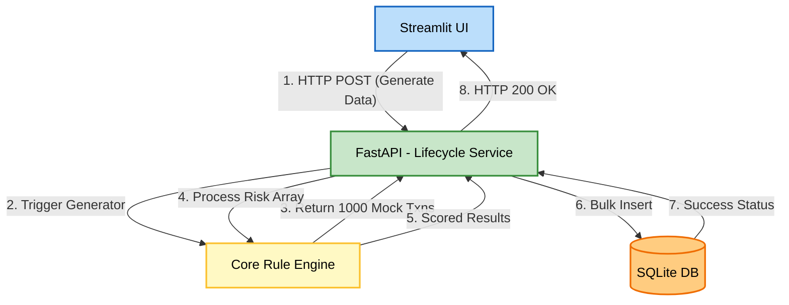
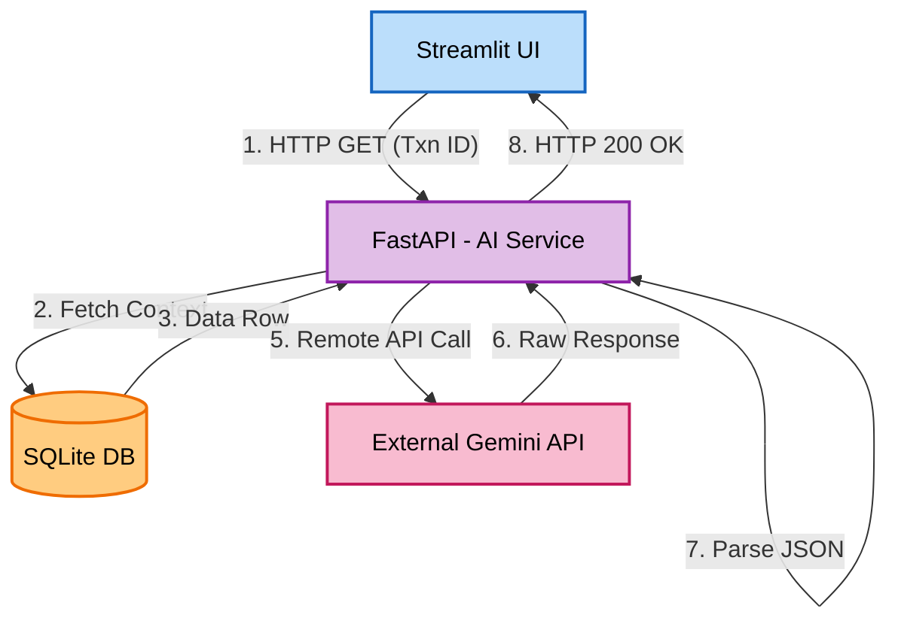

# Application Services

This document defines the core orchestrated services acting as the connective tissue between the frontend, backend rules, database, and external APIs.

## 1. Transaction Lifecycle Service
- **Purpose**: Manage the core data pipeline from synthetic generation to risk classification and database storage.
- **Responsibilities**: Orchestrates the creation of synthetic data (from UI button press), passes it through the Core Logic Engine, calculates the weighted Risk Score dynamically, and writes it sequentially to the Data Layer.

## 2. AI Insight Orchestration Service
- **Purpose**: Serve as a secure boundary for all Generative AI interactions.
- **Responsibilities**: Takes a Fraud UI request, fetches that exact user's transaction history from the SQLite database securely, compiles the strict Indian Context AI prompt, pings Gemini via the API Gateway, and formats the response to JSON for the presentation panel.

---

## Service Orchestration Flowcharts

The flowcharts below detail how these services route HTTP requests through the decoupled backend infrastructure.

### Transaction Lifecycle Workflow

### AI Insight Workflow

