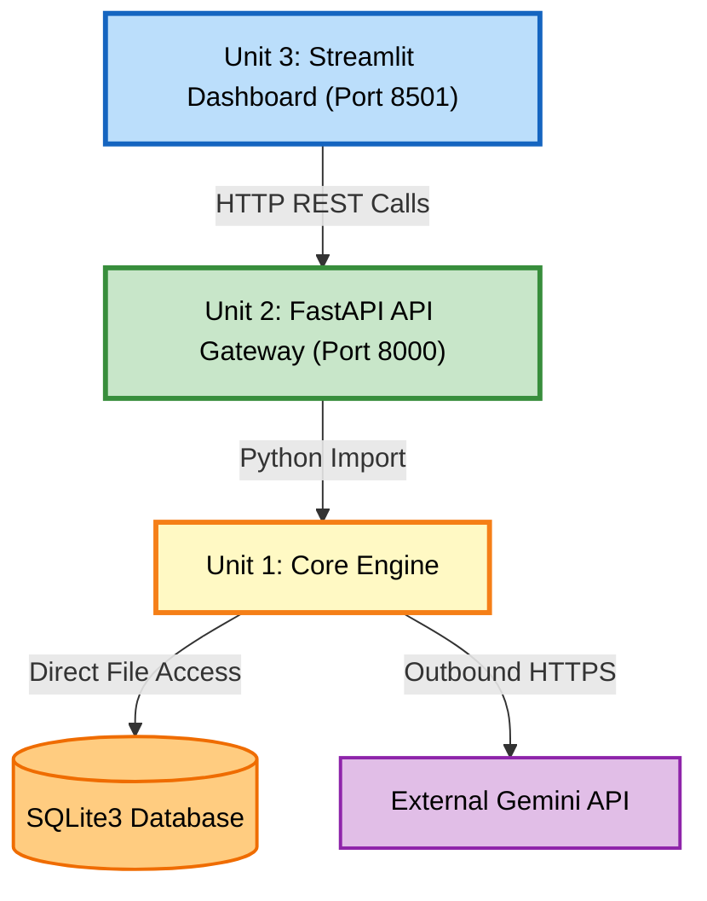

# Unit of Work Dependency Matrix

## Dependency Flowchart

---

## Dependency Table

| Unit | Depends On | Communication Protocol | Direction |
|------|-----------|----------------------|-----------|
| **Unit 1: Core Engine** | SQLite3 (embedded) | Direct file access | Internal |
| **Unit 1: Core Engine** | External Gemini API | Outbound HTTPS | Outbound |
| **Unit 2: API Gateway** | Unit 1: Core Engine | Python import (in-process) | Internal |
| **Unit 3: Dashboard** | Unit 2: API Gateway | HTTP REST (port 8000) | Network |

## Dependency Rules

1. **Unit 1 (Core Engine)** is fully standalone. It has no dependency on Unit 2 or Unit 3. It owns SQLite3 directly and makes outbound HTTPS calls to the Gemini API.
2. **Unit 2 (API Gateway)** imports Unit 1 as a Python package. It wraps core engine functions behind FastAPI HTTP endpoints. It cannot operate without Unit 1 being available as a dependency.
3. **Unit 3 (Dashboard)** has zero direct access to the Core Engine or SQLite3. All data flows exclusively through HTTP REST calls to Unit 2 (API Gateway) on port 8000.

## Execution Start Order

| Step | Action | Port |
|------|--------|------|
| 1 | Start FastAPI server (loads Unit 1 + Unit 2 together) | 8000 |
| 2 | Start Streamlit dashboard (Unit 3) | 8501 |

## Architectural Constraints
- Unit 3 must never bypass Unit 2 to access Unit 1 or SQLite3 directly.
- All external API calls (Gemini) originate exclusively from Unit 1.
- System must operate within 4GB RAM across both running processes.
