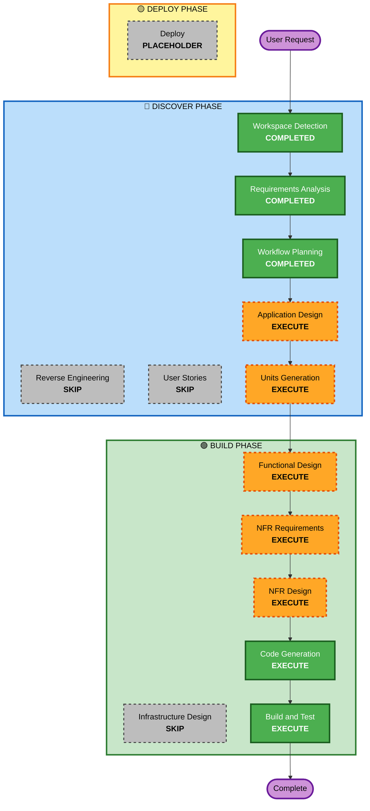

# Execution Plan

## Detailed Analysis Summary

### Change Impact Assessment
- **User-facing changes**: Yes - A completely new Streamlit interactive dashboard will be built.
- **Structural changes**: Yes - Creating a new system composed of core logic, FastAPI backend, and frontend.
- **Data model changes**: Yes - SQLite schema for transactions and rule thresholds.
- **API changes**: Yes - FastAPI endpoints connecting Streamlit to the backend core engine.
- **NFR impact**: Yes - Must be optimized to run strictly on a 4GB RAM local Windows machine with minimal latency.

### Risk Assessment
- **Risk Level**: Medium
- **Rollback Complexity**: Easy (New Project)
- **Testing Complexity**: Moderate (Mocking LLM API and synthetic dataset generation via TDD)

## Workflow Visualization

## Phases to Execute

### 🔵 DISCOVER PHASE
- [x] Workspace Detection (COMPLETED)
- [x] Reverse Engineering (SKIPPED)
- [x] Requirements Elaboration (COMPLETED)
- [x] User Stories (SKIPPED)
- [x] Execution Plan (IN PROGRESS)
- [ ] Application Design - [EXECUTE]
  - **Rationale**: We need to define identical interfaces and internal methods of the Logic Core, FastAPI, and UI components.
- [ ] Units Generation - [EXECUTE]
  - **Rationale**: The project clearly separates into decoupled logic steps forming unique software units of work.

### 🟢 BUILD PHASE
- [ ] Functional Design - [EXECUTE]
  - **Rationale**: Imperative constraint to strictly design the Weighted Scheme algorithm before starting generating classes.
- [ ] NFR Requirements - [EXECUTE]
  - **Rationale**: Windows specific execution bounds dictating 4GB RAM limit must constrain how the Gemini API logic and DB are loaded in python.
- [ ] NFR Design - [EXECUTE]
  - **Rationale**: Formalize the minimal patterns structure.
- [ ] Infrastructure Design - [SKIP]
  - **Rationale**: Local machine execution implies no Cloud infrastructure topology.
- [ ] Code Generation - [EXECUTE]
  - **Rationale**: Logic creation.
- [ ] Build and Test - [EXECUTE]
  - **Rationale**: TDD rule conformance through validation scripts.

### 🟡 DEPLOY PHASE
- [ ] Deploy - PLACEHOLDER
  - **Rationale**: Future deployment workflows.

## Estimated Timeline
- **Total Phases**: 8 actionable items logic.
- **Estimated Duration**: ~1 hour execution block mapping.

## Success Criteria
- **Primary Goal**: Fully functioning and isolated dashboard without errors.
- **Key Deliverables**: TDD Python modules, pytest scripts, UI rendering locally.
