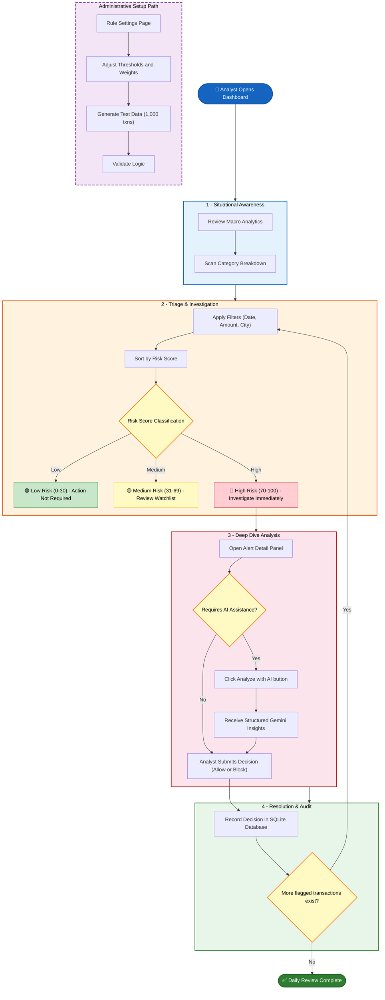

# Fraud Analyst Daily Review Journey

This outlines the primary workflow of the System Administrator and Fraud Analyst using the FraudShield platform.

## Workflow Summary

| Phase | Actor | Key Activities | Outcome |
|-------|-------|----------------|---------|
| **1 - Situational Awareness** | Fraud Analyst | Review macro analytics, category breakdown | Operational context established |
| **2 - Triage & Investigation** | Fraud Analyst | Filter, sort, classify by Risk Score | Prioritized investigation queue |
| **3 - Deep Dive** | Fraud Analyst + Gemini AI | Inspect rule breakdown, invoke AI analysis | Structured insight and recommendation |
| **4 - Resolution & Audit** | Fraud Analyst | Allow / Block / Escalate, record decision | Auditable decision trail |
| **Admin Setup Pathway** | System Administrator | Adjust thresholds, generate test data | Engine tuned for localized Indian banking |
